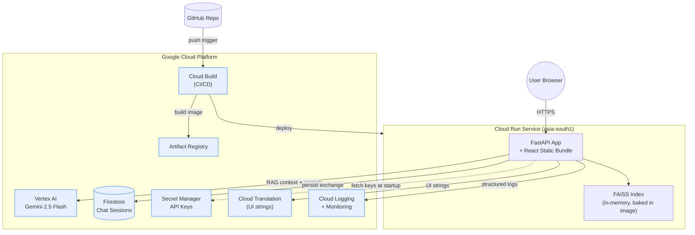

# Chunav Saathi (चुनाव साथी)
## 6-Hour Hackathon Build Plan — PRD, Architecture & Vibe-Code Prompts

> An AI-powered, bilingual, fully accessible assistant that helps Indian voters understand the election process across all three levels (Lok Sabha, Vidhan Sabha, Panchayat). Built solo with Claude Code in 6 hours, deployed to Google Cloud Run.

---

## 0. Strategic Read

The judging rubric is **engineering excellence**, not innovation theater. Code quality, security, efficiency, testing, accessibility, and meaningful Google services integration. Every architectural decision in this doc maps to one of those six criteria. We do not chase flashy features. We build a tightly scoped product that scores 9/10 on every rubric line.

---

## 1. Product Requirements

### 1.1 Problem
Indian voters across three election levels lack a single accessible source to understand the election process, their role, timelines, and eligibility. ECI resources are dense, English-heavy, not conversational, and not accessible to screen readers or non-English speakers.

### 1.2 Solution
A bilingual (Hindi conversational + English/Hindi UI), AI-powered, fully accessible web assistant that explains elections through grounded chat, interactive timelines, and an eligibility checker.

### 1.3 Target Users
First-time voters, general public, civic educators, students preparing for civics exams, voters with accessibility needs.

### 1.4 Core User Flows
1. Land → pick election level → see interactive timeline of phases
2. Open chat → ask "When is the model code of conduct enforced?" → get grounded answer with source citations
3. Open eligibility form → fill basic details → get instant yes/no with reasoning and next steps
4. Toggle to Hindi → entire UI plus chat responds in Hindi
5. Tap mic → speak question in Hindi or English → get spoken-to-text answer

### 1.5 Functional Requirements
| ID | Requirement |
|----|-------------|
| F1 | Conversational chat about Indian election process, RAG-grounded |
| F2 | Visual timeline of phases per election level |
| F3 | Voter eligibility checker with reasoning |
| F4 | Bilingual: English + Hindi (UI + chat) |
| F5 | Voice input via Web Speech API |
| F6 | Suggested sample questions per level |
| F7 | Source citations on every answer |

### 1.6 Non-Functional Requirements
| ID | Requirement | Target |
|----|-------------|--------|
| NF1 | Lighthouse Accessibility | ≥ 95 |
| NF2 | First Contentful Paint (4G) | < 1.5s |
| NF3 | Backend test coverage | ≥ 70% |
| NF4 | Secrets management | All via Secret Manager, none in code |
| NF5 | Per-IP rate limit | 30 req/min |
| NF6 | Cold start | < 5s |
| NF7 | Chat responses | Streamed via SSE |

### 1.7 Out of Scope (Cut for Time)
Live ECI data scraping, polling station finder, real-time results, user accounts, mobile app, candidate or party comparison, social features.

### 1.8 Success Metrics for Judges
- Lighthouse Accessibility ≥ 95 (screenshot in README)
- Test coverage ≥ 70% (badge in README)
- 7 meaningfully integrated GCP services (listed in README)
- Working CI/CD via Cloud Build (commit history shows automated deploys)
- Working bilingual demo in under 2 seconds per response
- Live demo URL + 90-second Loom walkthrough

---

## 2. System Architecture

### 2.1 High-Level Diagram



### 2.2 Components
- **Frontend:** React 18 + TypeScript + Vite + Tailwind, served as static files by FastAPI
- **Backend:** FastAPI on Python 3.11, single Cloud Run service
- **RAG layer:** FAISS in-memory, built at Docker build time (not runtime)
- **LLM:** Gemini 2.5 Flash via google-genai SDK
- **Storage:** Firestore (Native mode) for chat sessions
- **Secrets:** Google Secret Manager
- **Observability:** Cloud Logging (structured JSON) + Cloud Monitoring auto-instrumented
- **CI/CD:** Cloud Build trigger on git push → Cloud Run deploy

### 2.3 Chat Query Data Flow
1. User types message → browser POSTs to `/api/chat` (SSE response expected)
2. FastAPI: rate-limit check → Pydantic validation
3. Detect language (or accept from client)
4. RAG: embed query with `gemini-embedding-001` → FAISS retrieve top 5 chunks (filtered by level + lang)
5. Construct grounded prompt: system message + retrieved context + chat history + user query
6. Stream Gemini response back via SSE
7. After stream completes, persist exchange to Firestore (anonymous session)
8. Browser renders streaming tokens with `aria-live="polite"` for screen readers

### 2.4 Why FAISS Built at Docker Build Time
Cold starts on Cloud Run with embeddings computed at startup take 30+ seconds. Baking the FAISS index into the Docker image makes startup "load file from disk → ready" — under 5 seconds. This is a major efficiency win and a talking point for the demo.

### 2.5 File Structure
```
chunav-saathi/
├── backend/
│   ├── app/
│   │   ├── main.py
│   │   ├── routers/
│   │   │   ├── chat.py
│   │   │   ├── timeline.py
│   │   │   └── eligibility.py
│   │   ├── rag/
│   │   │   ├── embed.py
│   │   │   ├── retriever.py
│   │   │   └── index_builder.py
│   │   ├── core/
│   │   │   ├── config.py
│   │   │   ├── security.py
│   │   │   └── logging.py
│   │   ├── services/
│   │   │   ├── gemini.py
│   │   │   ├── firestore.py
│   │   │   └── secrets.py
│   │   └── models/
│   │       └── schemas.py
│   ├── data/
│   │   ├── lok_sabha.yaml
│   │   ├── vidhan_sabha.yaml
│   │   ├── panchayat.yaml
│   │   ├── eligibility.yaml
│   │   ├── glossary.yaml
│   │   └── faqs.yaml
│   ├── tests/
│   │   ├── conftest.py
│   │   ├── test_chat.py
│   │   ├── test_timeline.py
│   │   ├── test_eligibility.py
│   │   └── test_rag.py
│   ├── pyproject.toml
│   └── faiss_index/  # built at Docker build time
├── frontend/
│   ├── src/
│   │   ├── components/
│   │   │   ├── ChatPanel.tsx
│   │   │   ├── Timeline.tsx
│   │   │   ├── EligibilityForm.tsx
│   │   │   ├── LanguageToggle.tsx
│   │   │   ├── LevelSelector.tsx
│   │   │   └── VoiceInput.tsx
│   │   ├── hooks/
│   │   │   ├── useChat.ts
│   │   │   └── useI18n.ts
│   │   ├── locales/
│   │   │   ├── en.json
│   │   │   └── hi.json
│   │   ├── App.tsx
│   │   └── main.tsx
│   ├── tailwind.config.js
│   ├── package.json
│   └── vite.config.ts
├── Dockerfile
├── .dockerignore
├── cloudbuild.yaml
├── .gcloudignore
├── README.md
└── .gitignore
```

### 2.6 Tech Stack
| Layer | Choice | Why |
|-------|--------|-----|
| Backend | Python 3.11 + FastAPI 0.115+ | Async, type-safe, fastest to test |
| LLM | Gemini 2.5 Flash | Cheap, fast, native multilingual |
| Embeddings | text-embedding-004 | Same Google ecosystem, free tier ample |
| Vector store | FAISS (faiss-cpu) | In-memory, zero infra, fast |
| Schema | Pydantic v2 | Validation + OpenAPI for free |
| Rate limit | slowapi | Drop-in for FastAPI |
| Tests | pytest + pytest-cov + httpx | Standard, coverage report ready |
| Frontend | React 18 + TS + Vite | Fast dev loop, small bundle |
| Styling | Tailwind 3 + Radix UI primitives | Radix gives accessibility for free |
| i18n | react-i18next | Industry standard |
| Container | Multi-stage Dockerfile, distroless runtime | Minimal attack surface |


## 3. Hour-by-Hour Execution Map

| Hour | Block | Prompts |
|------|-------|---------|
| 0:00 – 0:15 | GCP setup (above) | — |
| 0:15 – 0:30 | Project scaffold | Prompt 1 |
| 0:30 – 0:50 | Knowledge base YAMLs | Prompt 2 |
| 0:50 – 1:20 | RAG pipeline | Prompt 3 |
| 1:20 – 2:00 | API endpoints | Prompt 4 |
| 2:00 – 2:20 | Backend tests | Prompt 5 |
| 2:20 – 2:50 | Frontend layout + i18n | Prompt 6 |
| 2:50 – 3:30 | Chat + voice input | Prompt 7 |
| 3:30 – 3:50 | Timeline component | Prompt 8 |
| 3:50 – 4:15 | Eligibility form + a11y pass | Prompt 9 |
| 4:15 – 4:45 | Deploy to Cloud Run | Prompt 10 |
| 4:45 – 5:30 | **BUFFER** (something will break, you need this) | — |
| 5:30 – 6:00 | README + Loom + submit | Prompt 10 (latter half) |

---

